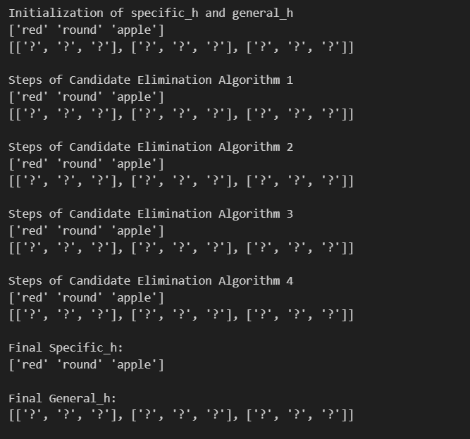

# Candidate Elimination Algorithm

Implementation of the Candidate Elimination Algorithm for concept learning in Machine Learning.

## About

The Candidate Elimination Algorithm is a concept learning algorithm that finds all hypotheses consistent with the training data. It maintains two boundaries: the most specific hypothesis (S) and the most general hypothesis (G), refining them with each training example until they converge to describe the target concept.

## Dataset

The algorithm is demonstrated using a fruit dataset with the following attributes:

**Features:**
- Color (red, yellow, green)
- Shape (round, cylinder)
- Fruit name (apple, banana, grapes, chilli)
- Target: Eat (yes/no)

## Algorithm Overview

The Candidate Elimination Algorithm works by:

1. **Initialize** the specific hypothesis (S) with the first positive example
2. **Initialize** the general hypothesis (G) with the most general hypothesis possible
3. **For each training example:**
   - If positive: Generalize S to include the example, remove inconsistent hypotheses from G
   - If negative: Specialize G to exclude the example, remove inconsistent hypotheses from S
4. **Converge** when S and G boundaries meet

## Implementation

The code implements the core learning function that:
- Processes each training instance sequentially
- Updates specific hypothesis (S) for positive examples
- Updates general hypothesis (G) for negative examples
- Tracks the evolution of both boundaries through each step
- Returns the final consistent hypothesis space

## Output

The algorithm demonstrates the step-by-step refinement of hypotheses:

The output shows the progression of specific and general hypotheses at each iteration, ultimately converging to the final hypothesis that correctly classifies all training examples.

## Key Concepts

- **Specific Hypothesis (S):** Most specific hypothesis consistent with positive examples
- **General Hypothesis (G):** Most general hypothesis consistent with negative examples
- **Version Space:** The space between S and G containing all valid hypotheses

## Usage

Run the notebook in Google Colab or Jupyter. Ensure the dataset is in the correct path or upload it to your environment.

---

*"Learning is finding out what you already know. Doing is demonstrating that you know it." - Richard Bach*