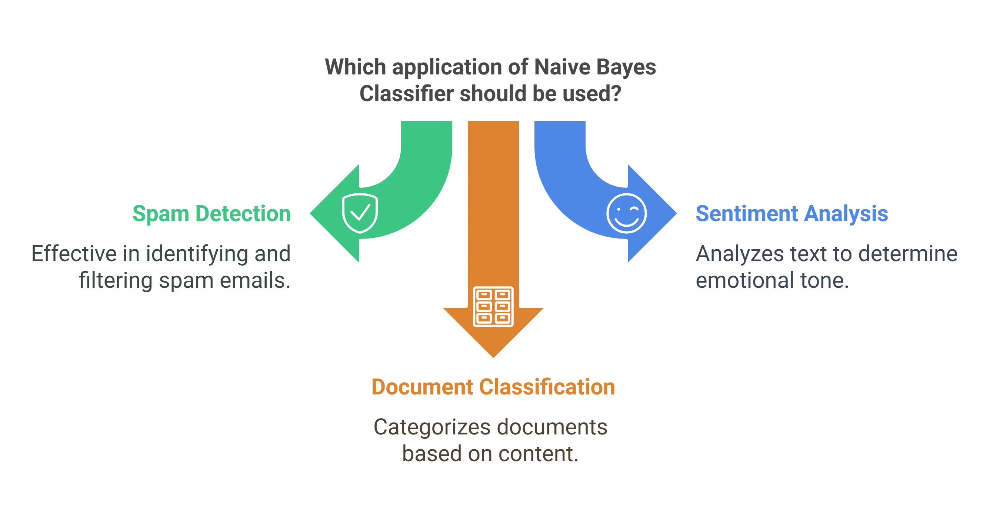
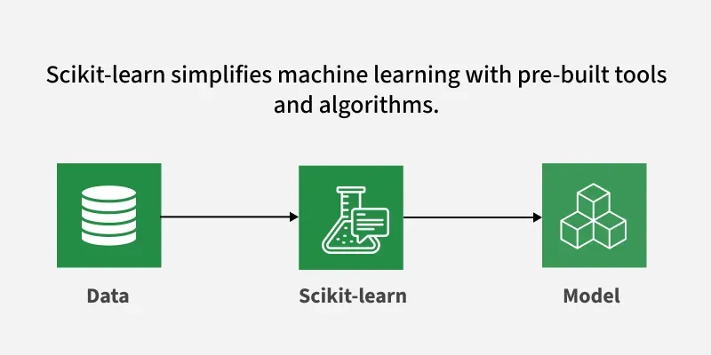

# Naive Bayes (In‑Built) — Easy Guide & Learning Module ✅



## What you will learn 💡
- Core idea behind **Naive Bayes** classifiers
- How to run the example `code/code.ipynb` using scikit‑learn
- How to read model outputs (predictions, confusion matrix, accuracy) with screenshots
- Short exercises to practice and compare variants (Gaussian/Multinomial/Bernoulli)

---

## Prerequisites 🔧
- Python 3.8+ with: `numpy`, `pandas`, `matplotlib`, `scikit-learn`, `jupyter`
- Open `code/code.ipynb` in VS Code or Jupyter Notebook

Quick install (if needed):

```
pip install numpy pandas matplotlib scikit-learn jupyter
```

---

## Files in this folder
- `code/code.ipynb` — working notebook using scikit‑learn Naive Bayes
- `data/` — sample datasets used in the notebook
- `screenshot/` — images embedded below to illustrate outputs

---

## Short intuition — how Naive Bayes works 🧭
Naive Bayes applies Bayes' theorem with the simplifying ("naive") assumption that features are conditionally independent given the class. Despite this strong assumption, it performs well for many problems (especially text classification) and is fast to train.

---

## How to run the notebook (step‑by‑step) ▶️
1. Open `code/code.ipynb` in VS Code / Jupyter.
2. Run cells top to bottom: load data → preprocess/encode → fit chosen Naive Bayes variant → evaluate.
3. Try different variants: `GaussianNB`, `MultinomialNB`, `BernoulliNB` depending on the data.
4. Inspect `confusion_matrix`, classification report and plotted output images.

---

## Notebook outputs — what to look for 🔎

### 1) Numeric evaluation & confusion matrix
Shows accuracy, precision/recall and the confusion matrix for model performance.


What it shows: where the model confuses classes and overall accuracy — useful for quick model checks.

---

### 2) Use‑case visualization / summary graphic
A pictorial summary showing when Naive Bayes is a good choice (e.g., text classification).


---

### 3) Full notebook run (visual walkthrough)
End‑to‑end screenshot showing code, outputs and plots running in the notebook.



---

## Quick explanation of core notebook sections 🔬
- Data load & EDA — check feature types and class balance.
- Preprocessing — encode categorical/text features (CountVectorizer/Tfidf for text).
- Model fitting — pick appropriate NB variant and call `.fit()`.
- Evaluation — `predict()`, `confusion_matrix`, `classification_report`.

---

## Exercises to practice 📝
1. Compare `GaussianNB` vs `MultinomialNB` on the same dataset.
2. For text data: test `CountVectorizer` vs `TfidfVectorizer` before training.
3. Inspect where the model makes errors using the confusion matrix and sample misclassified rows.
4. Measure how performance changes with feature selection or removing noisy features.

---

## Tips & common pitfalls ⚠️
- MultinomialNB is best for count‑based features (text), GaussianNB for continuous numeric features.
- Naive Bayes assumes conditional independence — correlated features can reduce performance.
- Always check class balance; use appropriate metrics if classes are imbalanced.

---

## Further reading 📚
- scikit‑learn Naive Bayes: https://scikit-learn.org/stable/modules/naive_bayes.html
- Tutorials on text preprocessing with CountVectorizer / TfidfVectorizer

---

## License
You may reuse or adapt this learning module for personal study. © Your Project
