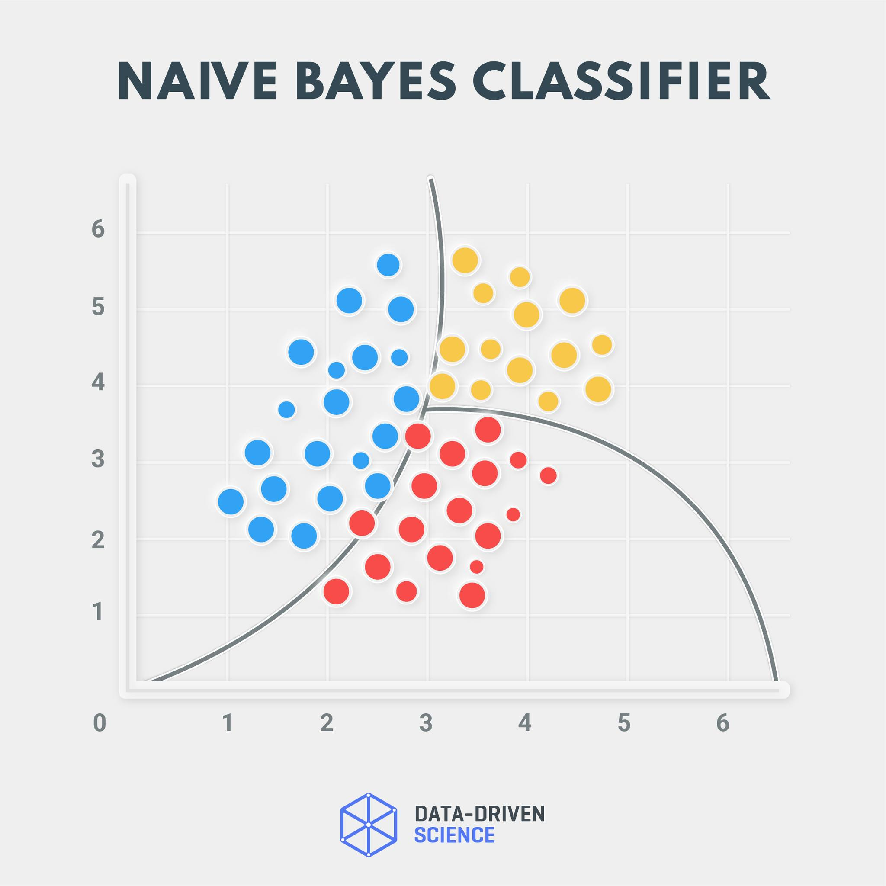
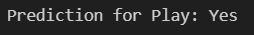

# Naive Bayes (Manual Implementation) — Easy Guide & Learning Module ✅


## What you will learn 💡
- The mathematical intuition behind **Naive Bayes** (manual derivation)
- How to implement Naive Bayes from scratch (step‑by‑step) in `code/code.ipynb`
- How to interpret model outputs with screenshots and plots
- Exercises to practice and compare with scikit‑learn implementation

---

## Prerequisites 🔧
- Basic Python knowledge and familiarity with `numpy` and `pandas`
- Recommended: `matplotlib` for plots and `jupyter`/`notebook` to run the example

Quick install (if needed):

```
pip install numpy pandas matplotlib jupyter
```

---

## Files in this folder
- `code/code.ipynb` — manual Naive Bayes implementation and walkthrough
- `data/` — sample datasets used in the notebook
- `screenshot/` — images used below to explain formulas and outputs

---

## Short intuition — manual perspective 🧭
Naive Bayes applies Bayes' theorem and treats features as conditionally independent given the class. A manual implementation shows how to compute prior probabilities, likelihoods (Gaussian or discrete), multiply them and pick the class with the highest posterior probability.

---

## How to run the notebook (step‑by‑step) ▶️
1. Open `code/code.ipynb` in VS Code or Jupyter.
2. Run cells sequentially: load data → compute priors & likelihoods → implement predict() → evaluate.
3. Compare manual predictions with `sklearn.naive_bayes` to validate your implementation.

---

## Notebook outputs — what to look for 🔎

### 1) Formula & derivation (visual)
Shows the Bayes theorem and the independence assumption used in calculations.


---

### 2) Probability plots / decision visualization
Visual representation of class‑conditional distributions used to compute likelihoods.



---

### 3) Numeric output / evaluation
Printed metrics and example predictions to verify the manual implementation.



---

## Key notebook sections 🔬
- Data load & EDA — examine feature distributions and class labels.
- Estimate priors — P(class) from training labels.
- Estimate likelihoods — for continuous features use Gaussian assumptions (mean, var).
- Prediction — compute posterior ∝ prior × likelihood and choose argmax.
- Evaluation — compare accuracy and confusion matrix with scikit‑learn.

---

## Exercises to practice 📝
1. Implement Laplace (add‑one) smoothing for categorical data.
2. Replace Gaussian likelihood with kernel density estimates and compare.
3. Compare manual implementation with `GaussianNB` on the same dataset.
4. Add cross‑validation to evaluate stability.

---

## Tips & common pitfalls ⚠️
- Beware of zero probabilities — use Laplace smoothing for categorical features.
- Log probabilities prevent underflow when multiplying small likelihoods.
- Check feature distributions — Gaussian assumption may not hold for every feature.

---

## Further reading 📚
- Wikipedia: Bayes' theorem and Naive Bayes
- scikit‑learn Naive Bayes docs for reference implementations

---

## License
You may reuse or adapt this learning module for personal study. © Your Project
