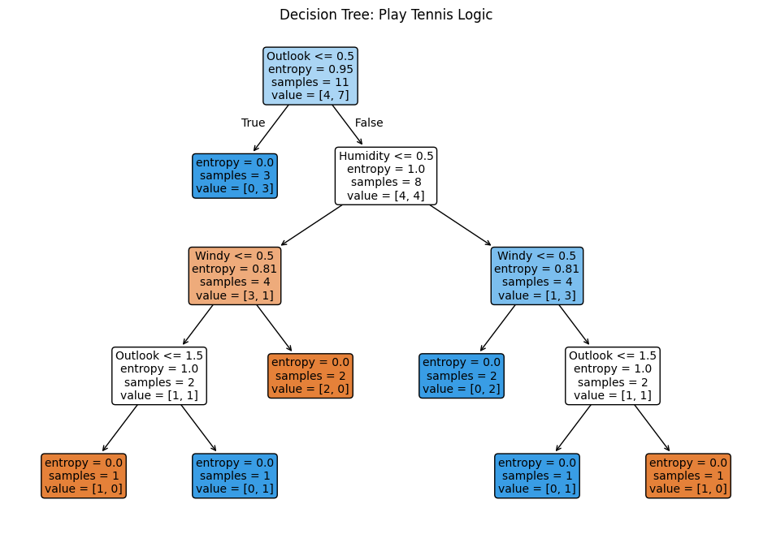

# Decision Tree — Easy Guide & Learning Module ✅


## What you will learn 💡
- Intuition behind **Decision Tree** classifiers and regressors
- How to run and inspect the example `code.ipynb`
- How to interpret tree plots, predictions and evaluation outputs (with screenshots)
- Hands‑on exercises and tips to improve model performance

---

## Prerequisites 🔧
- Python 3.8+ with: `numpy`, `pandas`, `matplotlib`, `scikit-learn`, `graphviz` (optional), `jupyter`
- Open the notebook `code/code.ipynb` in VS Code or Jupyter Notebook

Quick install (if needed):

```
pip install numpy pandas matplotlib scikit-learn jupyter graphviz
```

---

## Files in this folder
- `code/code.ipynb` — interactive notebook with full Decision Tree examples
- `data/data.csv` — example dataset used in the notebook
- `screenshot/` — images embedded below to explain outputs

---

## Short intuition — how Decision Trees work 🧭
Decision Trees split the feature space into regions using simple rules (yes/no or threshold comparisons). Each split is chosen to maximise purity (e.g., information gain or Gini reduction) and the final leaves represent predicted classes or values.

---

## How to run the notebook (step‑by‑step) ▶️
1. Open `code/code.ipynb` in VS Code / Jupyter.
2. Run cells sequentially: load data → preprocess → fit DecisionTreeClassifier/Regressor → visualize & evaluate.
3. Change `max_depth`, `min_samples_split`, or `criterion` to see how the tree and performance change.
4. Use `export_text` or `plot_tree` to inspect learned rules and splits.

---

## Notebook outputs — what to look for 🔎

### 1) Tree visualization / rules
Visual tree helps you read decision rules and see important features.



What it shows: split conditions, class distribution in leaves and depth — useful for model interpretation.

---

### 2) Feature importance & performance
Check `feature_importances_`, confusion matrix and accuracy/MAE depending on task.

---

### 3) Full notebook run (visual walkthrough)
End‑to‑end screenshot showing code, outputs and plots.


---

## Key notebook sections 🔬
- Data load & EDA — inspect distributions and class balance.
- Preprocessing — encode categorical features, scale if needed (not always required).
- Model training — tune `max_depth`, `min_samples_leaf`, `criterion`.
- Interpretation — `plot_tree`, `export_text`, `feature_importances_`.
- Evaluation — confusion matrix, classification report or regression metrics.

---

## Exercises to practice 📝
1. Limit `max_depth` and observe changes to overfitting/underfitting.
2. Compare `criterion='gini'` vs `criterion='entropy'` on the same dataset.
3. Prune the tree (or set `min_samples_leaf`) and compare test performance.
4. Replace Decision Tree with `RandomForestClassifier` and compare feature importance.

---

## Tips & common pitfalls ⚠️
- Decision Trees easily overfit if unrestricted — use `max_depth` / pruning.
- They can handle mixed data types but watch for high cardinality categorical features.
- Trees are not very stable — small data changes can change the structure dramatically.

---

## Further reading 📚
- scikit‑learn DecisionTree: https://scikit-learn.org/stable/modules/tree.html
- Articles on pruning, ensemble methods (Bagging, Random Forest)

---

## License
Feel free to reuse and adapt this learning module for personal study. © Your Project
