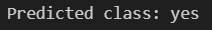

# K‑Nearest Neighbour (K‑NN) — Easy Guide & Learning Module ✅


## What you will learn 💡
- Intuition behind **K‑Nearest Neighbour (K‑NN)**
- How to run and modify the example `code/code.ipynb`
- How to evaluate K‑NN predictions and tune `k` (with screenshots)
- Practical exercises to deepen understanding

---

## Prerequisites 🔧
- Python 3.8+ with: `numpy`, `pandas`, `matplotlib`, `scikit-learn`, `jupyter`/`notebook`
- Open the notebook `code/code.ipynb` in VS Code or Jupyter

Quick install (if needed):

```
pip install numpy pandas matplotlib scikit-learn jupyter
```

---

## Files in this folder
- `code/code.ipynb` — interactive notebook with the full implementation
- `data/data.csv` — dataset used in the notebook
- `screenshot/` — images used below to explain outputs

---

## Short intuition — how K‑NN works (one paragraph) 🧭
K‑NN predicts the label for a point by finding the `k` nearest training examples (using a distance metric like Euclidean) and taking a majority vote (classification) or average (regression). It is a simple, instance‑based (lazy) learner — no explicit training model is built.

---

## How to run the notebook (step‑by‑step) ▶️
1. Open `code/code.ipynb` in VS Code / Jupyter.
2. Run cells from top to bottom (load data → split → scale → fit → evaluate).
3. Change `n_neighbors` (the `k` value) and `metric` to experiment.
4. Inspect confusion matrix, accuracy and scatter plots to understand behavior.

---

## Notebook outputs — what to look for 🔎

### 1) Decision regions / visualization
Shows how the classifier partitions feature space based on `k`.


What it shows: boundaries change with `k` (small `k` → more complex boundaries; large `k` → smoother decision surface).

---

### 2) Numeric output / evaluation
Printed metrics (accuracy, classification report) and predicted labels.



What it shows: performance numbers you should track when tuning hyperparameters.

---

### 3) Full notebook run (visual walkthrough)
End‑to‑end screenshot showing code, outputs and plots.


---

## Key notebook sections 🔬
- Data load & preview — check class balance and feature ranges.
- Train/test split — keep a hold‑out test set for final evaluation.
- Scaling — use `StandardScaler` (important for distance‑based methods).
- Fit & predict — set `n_neighbors` and `metric` in `KNeighborsClassifier`.
- Evaluation — accuracy, confusion matrix, classification report and visual plots.

---

## Exercises to practice 📝
1. Change `k` and observe how accuracy and decision boundaries change.
2. Scale features vs. not scaling — compare results.
3. Try different metrics (`euclidean`, `manhattan`) and compare.
4. Use cross‑validation to pick the best `k` and plot the validation curve.

---

## Tips & common pitfalls ⚠️
- Always scale features for K‑NN — distances are sensitive to feature scale.
- K‑NN is slow on large datasets because it computes distances to all points.
- High dimensional data may degrade performance (curse of dimensionality).
- Imbalanced classes require careful metrics (precision/recall) rather than accuracy alone.

---

## Further reading 📚
- scikit‑learn KNeighbors: https://scikit-learn.org/stable/modules/neighbors.html
- Tutorials on cross‑validation and distance metrics

---

## License
Feel free to reuse and modify this learning module for personal study. © Your Project
