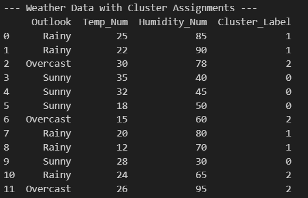
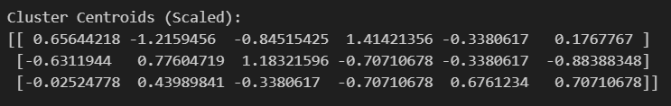

# K‑Means Clustering — Easy Guide & Learning Module ✅


## What you will learn 💡
- Intuition behind **K‑Means clustering**
- How to run the example `code.ipynb` step‑by‑step
- How to interpret cluster plots, centroids and assignments (with screenshots)
- Practical tips and simple exercises to reinforce learning

---

## Prerequisites 🔧
- Python 3.8+ with: `numpy`, `pandas`, `matplotlib`, `scikit-learn`, `jupyter`/`notebook`
- Open the notebook `code/code.ipynb` in VS Code or Jupyter Notebook

Quick install (if needed):

```
pip install numpy pandas matplotlib scikit-learn jupyter
```

---

## Files in this folder
- `code/code.ipynb` — interactive notebook with the full implementation
- `data/data.csv` — example dataset used in the notebook
- `screenshot/` — images used below to explain outputs

---

## Short intuition — how K‑Means works (3 steps) 🧭
1. Choose K (number of clusters).
2. Initialize K centroids randomly.
3. Repeat: assign each point to nearest centroid, then update centroids to the mean of assigned points — until convergence.

---

## How to run the notebook (step‑by‑step) ▶️
1. Open `code/code.ipynb` in VS Code / Jupyter.
2. Run cells from top to bottom (start with data import & visualization).
3. Change `n_clusters` to experiment with different K values.
4. Inspect the output plots and printed centroid coordinates.

---

## Notebook outputs — what to look for 🔎

### 1) Cluster assignment plot
Shows which points belong to each cluster.



What it shows: clusters colored differently and labels for each point — used to verify cluster separation.

---

### 2) Centroids after convergence
Centroids are plotted (usually as larger markers). These are the mean positions of their assigned points.



What it shows: final centroid coordinates — useful to understand cluster centers and summarize each group.

---

### 3) Full example run (visual walkthrough)
An end‑to‑end screenshot of the notebook running and producing plots.


---

## Quick explanation of core notebook sections 🔬
- Data load & preview — inspect `data.csv` to understand features.
- Preprocessing — scaling or cleaning (if included).
- Fitting KMeans — set `n_clusters` and call `KMeans.fit()`.
- Visualization — scatter plots colored by `labels_` and centroids from `cluster_centers_`.
- Evaluation & tuning — try different K and compare results.

---

## Exercises to practice 📝
1. Change `n_clusters` and observe how assignments change.
2. Scale features with `StandardScaler` and compare clusters.
3. Try k‑means on a different CSV (add/remove features).
4. Compute inertia and plot elbow curve to pick K.

---

## Tips & common pitfalls ⚠️
- K‑Means assumes spherical clusters and similar variances — it may fail on elongated or varying‑density clusters.
- Always scale features when they have different units.
- Initialization affects results — run with several `n_init` values.

---

## Further reading 📚
- scikit‑learn KMeans: https://scikit-learn.org/stable/modules/clustering.html#k-means
- Tutorials on Elbow method and silhouette score

---

## License
Feel free to reuse and modify this learning module for personal study. © Your Project
